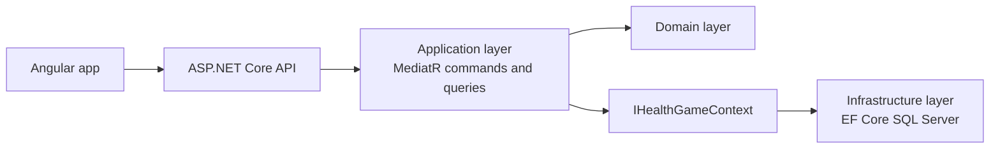

# The Health Game

[](LICENSE)


The Health Game is a mobile-first web app for defining personal health goals,
logging activity, tracking streaks, and earning rewards tied to goal progress.

The repository is organized as a full-stack application with an Angular frontend
and an ASP.NET Core backend that follows Clean Architecture, command/query
separation, Entity Framework Core persistence, and Microsoft SQL Server.

## Table of Contents

- [Status](#status)
- [Features](#features)
- [Architecture](#architecture)
- [Repository Structure](#repository-structure)
- [Requirements](#requirements)
- [Quick Start](#quick-start)
- [Configuration](#configuration)
- [Development Standards](#development-standards)
- [Testing](#testing)
- [Documentation](#documentation)
- [Roadmap](#roadmap)
- [Contributing](#contributing)
- [Security](#security)
- [Support](#support)
- [License](#license)

## Status

This project is in MVP development. The current implementation establishes the
application architecture and includes an initial goals slice:

- `POST /api/goals` creates an authenticated user's goal.
- `GET /api/goals` lists goals for the authenticated user.
- `GET /api/goals/{id}` reads a single owned goal.
- The frontend workspace contains app, API, component, and domain libraries with
  reusable presentation components and an initial dashboard flow.

Some planned capabilities, including full authentication flows, activity logging,
reward earning, EF Core migrations, Playwright end-to-end tests, and production
deployment assets, are still in progress.

## Features

- Personal health goal definition with cadence support.
- Activity logging and streak tracking requirements.
- Reward definition and earning requirements.
- Authenticated, user-scoped API design.
- Role-based access control requirements.
- Responsive Angular UI with Angular Material and design tokens.
- Clean Architecture backend with Domain, Application, Infrastructure, and API
  layers.
- Structured logging, correlation IDs, and centralized exception handling.

## Architecture



Backend dependencies point inward:

- `HealthGame.Domain` contains entities, value objects, and domain logic.
- `HealthGame.Application` contains use cases, DTOs, and abstractions.
- `HealthGame.Infrastructure` contains EF Core and adapter implementations.
- `HealthGame.Api` contains controllers, HTTP contracts, middleware, security
  composition, and dependency injection wiring.

Frontend dependencies follow workspace boundaries:

- `projects/api` owns backend-facing models and services.
- `projects/components` owns reusable UI-only components.
- `projects/domain` owns feature/domain UI and consumes API contracts.
- `projects/the-health-game` is the application shell.

## Repository Structure

```text
.
|-- backend/
|   |-- src/
|   |   |-- HealthGame.Api/
|   |   |-- HealthGame.Application/
|   |   |-- HealthGame.Domain/
|   |   `-- HealthGame.Infrastructure/
|   |-- tests/
|   `-- HealthGame.Backend.sln
|-- docs/
|   |-- specs/
|   |   |-- L1.md
|   |   `-- L2.md
|   `-- technology-guidance-and-practices.md
|-- frontend/
|   |-- projects/
|   |   |-- api/
|   |   |-- components/
|   |   |-- domain/
|   |   `-- the-health-game/
|   `-- package.json
`-- README.md
```

## Requirements

- [.NET SDK 10.0.101 or newer 10.0 feature band](https://dotnet.microsoft.com/)
- [Node.js](https://nodejs.org/) with npm 10.9.4 or compatible
- Microsoft SQL Server or SQL Server LocalDB
- Git

The backend defaults to SQL Server LocalDB on Windows:

```text
Server=(localdb)\MSSQLLocalDB;Database=HealthGame;Trusted_Connection=True;TrustServerCertificate=True
```

For non-Windows environments, use SQL Server in a container or another reachable
SQL Server instance and override the connection string with
`ConnectionStrings__HealthGame`.

## Quick Start

Clone the repository and install dependencies:

```bash
git clone <repository-url>
cd the-health-game
```

Run the backend:

```bash
cd backend
dotnet restore
dotnet build HealthGame.Backend.sln
dotnet run --project src/HealthGame.Api/HealthGame.Api.csproj
```

The API uses the launch profile URLs:

- `https://localhost:7035`
- `http://localhost:5224`

Run the frontend in a second terminal:

```bash
cd frontend
npm install
npm start
```

The Angular development server runs at `http://localhost:4200` by default.

## Configuration

Backend configuration uses ASP.NET Core configuration providers. Local defaults
live in `backend/src/HealthGame.Api/appsettings.json`.

Common environment variables:

```bash
ConnectionStrings__HealthGame="Server=localhost,1433;Database=HealthGame;User Id=sa;Password=<password>;TrustServerCertificate=True"
Authentication__Authority="https://your-issuer.example.com"
Authentication__Audience="the-health-game-api"
```

Do not commit secrets, tokens, passwords, private keys, or real user data.

## Development Standards

Backend:

- Use ASP.NET Core Controllers for HTTP endpoints.
- Use MediatR commands and queries for application use cases.
- Use EF Core `DbContext` directly through application-owned abstractions.
- Do not add repository or unit-of-work wrappers.
- Keep one top-level C# type per file and match file names to type names.
- Preserve Clean Architecture boundaries.

Frontend:

- Use Angular Material or project wrappers for UI primitives.
- Keep components split by file type: `.ts`, `.html`, and `.scss`.
- Use BEM class naming.
- Use design tokens for colors and spacing.
- Keep `components` presentation-only, with no dependency on `api` or `domain`.
- Expose consumed services through interfaces and `InjectionToken`s.

## Testing

Run backend tests:

```bash
cd backend
dotnet test HealthGame.Backend.sln
```

Run frontend tests:

```bash
cd frontend
npm test
```

Run frontend production build:

```bash
cd frontend
npm run build
```

Acceptance tests should include traceability comments back to the L2
requirements:

```text
// Acceptance Test
// Traces to: L2-001
// Description: Creates a valid authenticated user goal.
```

## Documentation

- [Backend README](backend/README.md)
- [Frontend README](frontend/README.md)
- [Technology guidance and practices](docs/technology-guidance-and-practices.md)
- [L1 high-level requirements](docs/specs/L1.md)
- [L2 detailed requirements](docs/specs/L2.md)
- [Product idea notes](docs/idea.md)
- [Execution notes](docs/execution.md)

## Roadmap

- Complete goal editing and deletion.
- Add activity logging and activity history.
- Implement current and longest streak computation across all cadence types.
- Add reward definition, earning, and display flows.
- Complete backend-issued OAuth2 token authentication and user management.
- Add EF Core migrations and database lifecycle documentation.
- Add Playwright end-to-end tests using the Page Object Model pattern.
- Add CI for backend, frontend, and end-to-end verification.

## Contributing

Contributions are welcome. Start with [CONTRIBUTING.md](CONTRIBUTING.md) for
local setup, coding standards, testing expectations, and pull request guidance.

This project follows the [Code of Conduct](CODE_OF_CONDUCT.md).

## Security

Please do not report security vulnerabilities in public issues. Follow
[SECURITY.md](SECURITY.md) for responsible disclosure guidance.

## Support

For help with setup, reproducible bugs, documentation problems, or scoped
enhancement proposals, see [SUPPORT.md](SUPPORT.md).

## License

The Health Game is released under the [MIT License](LICENSE).
